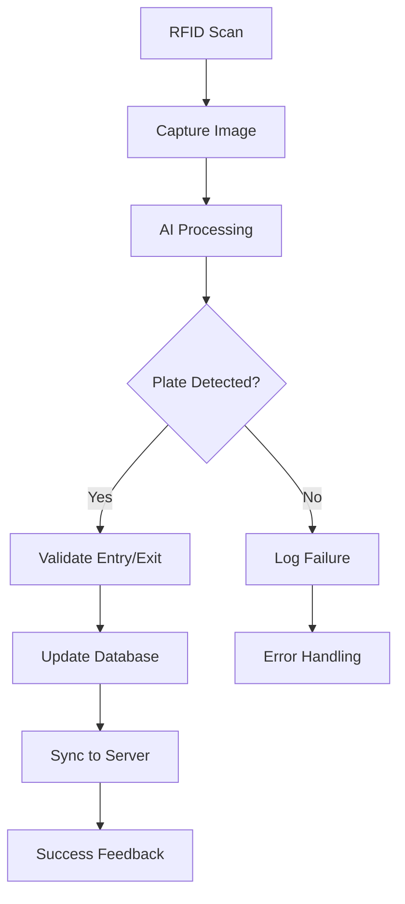

# Complete Parking System Documentation

## Table of Contents
1. [README](#readme)
2. [User Manual](#user-manual)
3. [Scripts Documentation](#scripts-documentation)
4. [Network Access Guide](#network-access-guide)
5. [Network Fix Summary](#network-fix-summary)

---

## README
# CE232 - License Plate Recognition & RFID Parking System

[](https://www.python.org/downloads/)
[](LICENSE)
[](https://github.com/psf/black)

## 🚗 Project Overview

This project is an **on-premise, automated parking management system** that uses computer vision and RFID technology to control vehicle access. It is designed for robust, offline-first operation, ensuring continuous functionality even without a stable network connection. The system captures vehicle entries and exits, validates them against a local database, and synchronizes event data with a remote server.

### ✨ Key Highlights

- 🤖 **AI-Powered**: YOLOv5-based license plate recognition
- 🔄 **Offline-First**: Works without internet connectivity
- 🔒 **Secure**: Multi-layer validation and security checks
- 🌐 **Web Interface**: Real-time monitoring dashboard
- 🧹 **Clean Code**: Modular, maintainable architecture

## 🎯 Features

### Core Functionality
- 🔍 **Real-time License Plate Recognition**: YOLOv5-based model for automatic plate detection and OCR
- 📡 **RFID Integration**: MFRC522 reader for fast and reliable vehicle authentication
- 💾 **Offline-First Operation**: Local SQLite database ensures functionality without network connectivity
- 🔄 **Smart Data Synchronization**: Background thread handles server sync with intelligent retry logic
- 🛡️ **Security Validation**: Multi-layer checks prevent unauthorized access and detect anomalies

### Monitoring & Logging
- 📊 **Web Dashboard**: Real-time monitoring interface built with Flask
- 📝 **Comprehensive Logging**: Structured JSONL access logs and detailed error logging
- 📈 **Statistics & Analytics**: Daily, weekly, and monthly usage reports
- 🚗 **Live Vehicle Tracking**: Real-time view of vehicles currently in the parking lot

### Technical Features
- 🎥 **Live Camera Feed**: Real-time video streaming for monitoring
- 🔧 **Modular Architecture**: Clean, maintainable code structure
- 🏷️ **Type Safety**: Comprehensive type hints for better development experience
- ⚙️ **Configuration Management**: Centralized config with environment variables

## 🛠️ Hardware Requirements

### Minimum Requirements
- **Computing Device**: Raspberry Pi 4+ (4GB RAM recommended) or standard PC
- **Camera**: USB Webcam or IP Camera compatible with OpenCV
- **RFID Reader**: MFRC522 module with associated RFID tags
- **LED Indicator**: Green LED for success feedback (GPIO controlled)

### Recommended Setup
- **Raspberry Pi 4 (8GB)** for optimal AI model performance
- **High-resolution camera** (1080p+) for better plate recognition
- **Weatherproof housing** for outdoor installations
- **UPS backup** for continuous operation

## 📦 Software Requirements

### Core Dependencies
```bash
Python 3.8+
PyTorch 2.7.0+
OpenCV 4.11.0+
Flask 3.1.1+
SQLite3 (built-in)
```

### Hardware Interface
```bash
RPi.GPIO          # Raspberry Pi GPIO control
mfrc522           # RFID reader interface
spidev            # SPI communication
```

### AI & Computer Vision
```bash
ultralytics       # YOLOv5 implementation
torch             # PyTorch framework
torchvision       # Computer vision utilities
```

## 🏗️ Architecture

### Project Structure
```
minhtest/
├── 🐍 Core Application
│   ├── LPR.py              # Main application logic
│   ├── app.py              # Flask web interface
│   └── start.sh            # System startup script
├── 🔧 Configuration
│   ├── constants.py        # System constants
│   ├── utils.py            # Utility functions
│   ├── config.py           # Configuration management
│   └── .env               # Environment variables
├── 🤖 AI Modules
│   ├── function/
│   │   ├── helper.py       # License plate OCR
│   │   └── utils_rotate.py # Image preprocessing
│   └── model/             # YOLOv5 model files
├── 🌐 Web Interface
│   └── templates/         # HTML templates
├── 📁 Runtime Data
│   ├── picture/           # Captured images
│   ├── tmp/              # Temporary files
│   └── offline_images/   # Offline storage
└── 📚 Documentation
    ├── README.md
    ├── CODE_CLEANUP.md
    └── GIT_MANAGEMENT.md
```

## 🚀 Quick Start

```bash
# 1. Setup environment
python3 -m venv ai_env
source ai_env/bin/activate
pip install -r requirements.txt

# 2. Configure system
cp .env.example .env
# Edit .env with your settings

# 3. Run system
chmod +x start.sh
./start.sh
```

Access web interface at `http://localhost:5000`

## 📖 How It Works

### System Flow



### Detailed Process

1. **🏁 Initialization**
   - Load configuration from `config.py`
   - Initialize SQLite database
   - Load YOLOv5 models for detection and OCR
   - Setup camera and RFID reader connections
   - Start background sync threads

2. **🔄 Main Loop**
   - Wait for RFID tag scan
   - Capture high-resolution image
   - Process image through AI pipeline
   - Extract and normalize license plate text

3. **🛡️ Validation Logic**
   - **Entry**: Verify plate not already inside
   - **Exit**: Confirm plate matches entry record
   - Apply security checks and business rules
   - Handle edge cases and errors

4. **💾 Data Management**
   - Store all events in local SQLite database
   - Log structured data to JSONL files
   - Background sync to remote server
   - Handle network failures gracefully

## 🌐 Web Interface

Access the monitoring dashboard at `http://localhost:5000`

- 📹 **Live Camera View**: Real-time video feed
- 📝 **Access History**: Event logs with search and pagination
- 🚗 **Vehicles in Lot**: Current occupancy management
- 📈 **Analytics**: Usage statistics and reports

## 🌐 Network Access Guide

### Web Interface Access

The Flask web interface binds to all network interfaces (`0.0.0.0:5000`) and can be accessed from:

#### From the Raspberry Pi (Local Access)
```bash
http://localhost:5000
http://127.0.0.1:5000
```

#### From Remote Devices (Phones, Laptops, etc.)
```bash
http://192.168.1.29:5000  # Replace with your Pi's actual IP
```

#### Get Your Pi's IP Address
```bash
hostname -I | awk '{print $1}'
```

### Network Troubleshooting

#### ❌ Common Issue: "localhost:5000 doesn't work from my phone"
**Solution**: Use the Raspberry Pi's IP address instead
- `localhost` on your phone refers to your phone, not the Pi
- Always use the Pi's actual IP (e.g., `192.168.1.29:5000`) from remote devices

#### Test Network Connectivity
```bash
./network_test.sh  # Run comprehensive network test
./status.sh        # Check system status with access URLs
```

#### Optional: Add Hostname Mapping
Add this to your device's hosts file for easier access:
```
192.168.1.29    parking-pi.local
```
Then access via: `http://parking-pi.local:5000`

**Hosts file locations:**
- Windows: `C:\Windows\System32\drivers\etc\hosts`
- macOS/Linux: `/etc/hosts`

## � Documentation

- 📖 **[Installation Guide](INSTALLATION.md)** - Detailed setup instructions
- 🔧 **[User Manual](USER_MANUAL.md)** - Complete usage guide
- 🏗️ **[Code Architecture](CODE_CLEANUP.md)** - Technical documentation
- 🔧 **[Git Management](GIT_MANAGEMENT.md)** - Repository guidelines

## 📄 License

This project is licensed under the MIT License - see the [LICENSE](LICENSE) file for details.

---

Made with ❤️ for CE232 - Intelligent Parking Management

---

## User Manual
# User Manual

## Tổng quan hệ thống

Hệ thống này là một giải pháp quản lý bãi đỗ xe tự động, sử dụng công nghệ nhận dạng biển số xe (LPR) và RFID để kiểm soát ra vào. Hệ thống được thiết kế để hoạt động độc lập, ưu tiên xử lý ngoại tuyến (offline-first), đảm bảo hoạt động liên tục ngay cả khi không có kết nối mạng ổn định.

## Giao diện Web

Giao diện web cung cấp khả năng giám sát và quản lý hệ thống theo thời gian thực.

### Các tính năng chính

#### 1. Chế độ xem Camera trực tiếp (/)
- **Mục đích**: Giám sát hình ảnh trực tiếp từ camera.
- **Tính năng**:
    - Luồng video trực tiếp.
    - Cập nhật hình ảnh theo thời gian thực.
    - Chỉ báo trạng thái camera.

#### 2. Lịch sử truy cập (/log)
- **Mục đích**: Xem lại tất cả các sự kiện xe ra vào.
- **Tính năng**:
    - Danh sách sự kiện có thể tìm kiếm.
    - Phân trang.
    - Lọc theo loại sự kiện (VÀO, RA, LỖI).
    - Hình ảnh thu nhỏ cho mỗi sự kiện.
    - Dấu thời gian và chi tiết sự kiện.

#### 3. Xe trong bãi (/vehicles_in_lot)
- **Mục đích**: Quản lý các phương tiện hiện đang ở trong bãi.
- **Tính năng**:
    - Danh sách các xe hiện có trong bãi.
    - Thời gian vào của mỗi xe.
    - Khả năng cho xe ra theo cách thủ công.
    - Tìm kiếm theo biển số xe.

#### 4. Thống kê (/statistics)
- **Mục đích**: Xem phân tích sử dụng.
- **Tính năng**:
    - Báo cáo hàng ngày, hàng tuần, hàng tháng.
    - Số lượng xe vào và ra.
    - Các chỉ số hiệu suất hệ thống.

## Hoạt động của hệ thống

### Quy trình hoạt động

#### Quy trình xe vào
1.  **Quét RFID**: Người dùng đưa thẻ RFID vào đầu đọc.
2.  **Chụp ảnh**: Hệ thống tự động chụp ảnh.
3.  **Nhận dạng biển số**: AI xử lý ảnh để phát hiện biển số.
4.  **Xác thực**: Hệ thống kiểm tra tính hợp lệ của biển số để vào.
5.  **Cập nhật cơ sở dữ liệu**: Tạo bản ghi vào với trạng thái "INSIDE".
6.  **Phản hồi**: Đèn LED xanh lục nhấp nháy để báo hiệu vào thành công.

#### Quy trình xe ra
1.  **Quét RFID**: Người dùng đưa cùng một thẻ RFID vào đầu đọc.
2.  **Chụp ảnh**: Hệ thống chụp ảnh lúc ra.
3.  **Nhận dạng biển số**: AI phát hiện biển số.
4.  **Xác thực**: Hệ thống xác minh biển số khớp với bản ghi lúc vào.
5.  **Cập nhật cơ sở dữ liệu**: Cập nhật bản ghi với thời gian ra và trạng thái "COMPLETED".
6.  **Phản hồi**: Đèn LED xanh lục nhấp nháy để báo hiệu ra thành công.

### Các loại sự kiện

#### Sự kiện thành công
-   **IN**: Xe vào thành công.
-   **OUT**: Xe ra thành công.

#### Sự kiện thất bại
-   **FAIL_IN**: Vào không thành công do lỗi xác thực.
-   **FAIL_OUT**: Ra không thành công do lỗi xác thực.

#### Sự kiện thủ công
-   **MANUAL_OUT**: Xe được cho ra theo cách thủ công qua giao diện web.

### Các kịch bản lỗi

#### Các lý do thất bại phổ biến
1.  **NO_PLATE_DETECTED**: Camera không thể phát hiện biển số xe.
2.  **PLATE_MISMATCH**: Biển số lúc ra không khớp với biển số lúc vào.
3.  **ALREADY_INSIDE_DIFF_RFID**: Biển số đã ở trong bãi với một thẻ RFID khác.

## Quản lý dữ liệu

#### Tệp nhật ký
-   **access_log.jsonl**: Dữ liệu sự kiện có cấu trúc.
-   **error_log.txt**: Lỗi hệ thống và chẩn đoán.
-   **parking_data.db**: Cơ sở dữ liệu SQLite với tất cả các bản ghi.

#### Lưu trữ hình ảnh
-   **picture/**: Tất cả các hình ảnh đã chụp (vào/ra).
-   **tmp/**: Các tệp tạm thời (luồng camera trực tiếp).
-   **offline_images/**: Lưu trữ hình ảnh dự phòng.

## Quản lý cấu hình

### Biến môi trường (.env)

#### Cài đặt bắt buộc
```bash
API_ENDPOINT="http://server:3000/api/parking/events/submit"
UID="device-001"
YOLOV5_REPO_PATH="/home/minhtest/yolov5"
LP_DETECTOR_MODEL_PATH="model/LP_detector_nano_61.pt"
LP_OCR_MODEL_PATH="model/LP_ocr_nano_62.pt"
```

#### Cài đặt tùy chọn
```bash
DB_FILE="parking_data.db"
IMAGE_DIR="offline_images"
PICTURE_OUTPUT_DIR="picture"
```

### Cấu hình mô hình

#### Tệp mô hình AI
-   **LP_detector_nano_61.pt**: Mô hình phát hiện biển số xe.
-   **LP_ocr_nano_62.pt**: Mô hình nhận dạng ký tự

---

## Scripts Documentation
# Parking System Management Scripts

Sau khi sửa lỗi luồng xử lý dữ liệu, hệ thống đã được cải tiến với các script quản lý mới để vận hành dễ dàng hơn.

## 🚀 Scripts Quản Lý

### 1. `manage.sh` - Script Quản Lý Chính
```bash
./manage.sh start    # Khởi động hệ thống
./manage.sh stop     # Dừng hệ thống  
./manage.sh restart  # Khởi động lại
./manage.sh status   # Kiểm tra trạng thái
./manage.sh logs     # Xem logs gần đây
./manage.sh help     # Hiển thị hướng dẫn
```

### 2. `start.sh` - Khởi Động Hệ Thống
- Tự động cleanup các process cũ
- Khởi động Flask web interface trong background
- Chạy LPR.py (main parking system)
- Quản lý PID và cleanup tự động khi dừng

### 3. `stop.sh` - Dừng Hệ Thống An Toàn  
- Dừng tất cả processes liên quan
- Cleanup port 5000
- Force kill nếu cần thiết
- Báo cáo trạng thái cleanup

### 4. `status.sh` - Kiểm Tra Trạng Thái
- Hiển thị trạng thái các services
- Kiểm tra ports và files
- Thống kê database
- Thông tin system resources

### 5. `network_test.sh` - Kiểm Tra Kết Nối Mạng
Kiểm tra toàn diện khả năng truy cập web interface từ các ngữ cảnh mạng khác nhau.

```bash
./network_test.sh
```

**Tính năng:**
- Kiểm tra localhost, 127.0.0.1 và truy cập IP bên ngoài
- Cung cấp hướng dẫn rõ ràng cho truy cập từ xa và cục bộ
- Hiển thị cấu hình mạng và chi tiết giao diện
- Giải thích lý do tại sao localhost không hoạt động từ các thiết bị từ xa

**Ví dụ về đầu ra:**
```
🌐 Kiểm Tra Kết Nối Mạng Hệ Thống Đỗ Xe
===========================================
📍 IP Raspberry Pi: 192.168.1.29
📍 Tên máy: raspberrypi

🧪 Đang Kiểm Tra Truy Cập Cục Bộ...
✅ localhost:5000 - CÓ THỂ TRUY CẬP
✅ 127.0.0.1:5000 - CÓ THỂ TRUY CẬP
✅ 192.168.1.29:5000 - CÓ THỂ TRUY CẬP

📊 Tóm Tắt Truy Cập:
├─ Từ Raspberry Pi này:
│  ├─ ✅ http://localhost:5000
│  ├─ ✅ http://127.0.0.1:5000
│  └─ ✅ http://192.168.1.29:5000
└─ Từ các thiết bị khác:
   └─ ✅ http://192.168.1.29:5000 (CHỈ)

💡 Hướng Dẫn Sử Dụng Mạng:
• Chỉ sử dụng localhost:5000 khi làm việc trực tiếp trên Pi này
• Sử dụng 192.168.1.29:5000 khi truy cập từ điện thoại, laptop, v.v.
• localhost trên các thiết bị từ xa trỏ đến localhost CỦA CHÚNG, không phải Pi này
```

## 🔧 Cách Sử Dụng

### Khởi động hệ thống lần đầu:
```bash
./manage.sh start
```

### Kiểm tra hệ thống đang chạy:
```bash
./manage.sh status
```

### Xem logs khi có vấn đề:
```bash
./manage.sh logs
```

### Dừng hệ thống:
```bash
./manage.sh stop
```

### Khởi động lại khi có lỗi:
```bash
./manage.sh restart
```

## 📁 Files Log

- `flask_app.log` - Logs của web interface
- `error_log.txt` - Logs lỗi hệ thống
- `parking_data.db` - Database chính
- `tmp/live_view.jpg` - Ảnh camera live

## 🌐 Web Interface

- URL: http://localhost:5000
- Camera trực tiếp: http://localhost:5000/
- Lịch sử: http://localhost:5000/log
- Xe trong bãi: http://localhost:5000/vehicles_in_lot
- Thống kê: http://localhost:5000/statistics

## 🛠️ Troubleshooting

### Khi có lỗi "Port 5000 already in use":
```bash
./manage.sh stop
./manage.sh start
```

### Khi database bị lock:
```bash
./manage.sh restart
```

### Khi camera không hoạt động:
- Kiểm tra camera kết nối
- Restart hệ thống
- Xem logs để biết chi tiết

### Khi network không sync được:
- Kiểm tra kết nối internet
- Kiểm tra API endpoint trong `.env`
- Xem error_log.txt

## 📊 Monitoring

### Theo dõi real-time:
```bash
# Theo dõi Flask logs
tail -f flask_app.log

# Theo dõi error logs  
tail -f error_log.txt

# Kiểm tra trạng thái định kỳ
watch -n 5 ./manage.sh status
```

## 🔒 System Security

- Tất cả scripts đều có proper cleanup
- Process management an toàn
- Database locking để tránh corruption
- Error handling toàn diện

## 💡 Tips

1. **Luôn dùng `manage.sh`** thay vì chạy trực tiếp các script khác
2. **Kiểm tra status** trước khi start/stop
3. **Xem logs** khi có vấn đề
4. **Backup database** định kỳ
5. **Monitor system resources** để tránh quá tải

---

*Scripts này được tạo để đi kèm với việc sửa lỗi luồng xử lý dữ liệu, đảm bảo hệ thống hoạt động ổn định và dễ quản lý.*

---

## Network Access Guide
# Network Access Guide for Flask Web Interface

## Issue Resolved: Remote vs Local Access Configuration

### The Problem (SOLVED)
The Flask web interface works when accessed via `192.168.1.29:5000` but not via `localhost:5000` when accessing from a **remote machine**. This is expected network behavior.

### Root Cause Analysis
When accessing the Raspberry Pi from a remote computer:
- `localhost:5000` refers to the **client machine's** localhost (not the Raspberry Pi)
- `192.168.1.29:5000` correctly refers to the **Raspberry Pi's** IP address
- This is standard networking behavior, not a system bug

### Dynamic IP Detection
To get the current Raspberry Pi IP address:
```bash
# Get primary IP address
hostname -I | awk '{print $1}'

# Or get all network interfaces
ip addr show | grep "inet " | grep -v 127.0.0.1
```

### Quick Access Commands
```bash
# From Raspberry Pi terminal - get your IP and test
PI_IP=$(hostname -I | awk '{print $1}')
echo "Access URLs:"
echo "  Local (on Pi):    http://localhost:5000"
echo "  Remote devices:   http://$PI_IP:5000"
echo ""
echo "Testing connectivity..."
curl -s -o /dev/null -w "localhost:5000 -> %{http_code}\n" http://localhost:5000
curl -s -o /dev/null -w "$PI_IP:5000 -> %{http_code}\n" http://$PI_IP:5000
```

### Network Configuration
- **Raspberry Pi IP**: `192.168.1.29`
- **Flask Binding**: `host='0.0.0.0', port=5000` (all interfaces)
- **Local Access**: Works on `localhost:5000` and `127.0.0.1:5000` from the Pi itself
- **Remote Access**: Must use `192.168.1.29:5000` from other machines

### Solutions

#### Option 1: Use Raspberry Pi IP Address (Recommended)
```
http://192.168.1.29:5000
```

#### Option 2: Add Host Entry on Client Machine
Add this line to your client machine's hosts file:
```
192.168.1.29    raspberrypi.local
```

Then access via:
```
http://raspberrypi.local:5000
```

**Hosts file locations:**
- **Windows**: `C:\Windows\System32\drivers\etc\hosts`
- **macOS/Linux**: `/etc/hosts`

#### Option 3: Set Up Local DNS or mDNS
Enable Avahi/Bonjour on the Raspberry Pi for `.local` domain resolution.

### Verification Tests
From the Raspberry Pi itself (all work):
```bash
curl -I http://localhost:5000        # ✅ Works
curl -I http://127.0.0.1:5000       # ✅ Works  
curl -I http://192.168.1.29:5000    # ✅ Works
```

From remote machines:
```bash
curl -I http://localhost:5000        # ❌ Fails (points to client's localhost)
curl -I http://192.168.1.29:5000    # ✅ Works (points to Raspberry Pi)
```

### Recommended Access URLs
- **From Raspberry Pi**: `http://localhost:5000`
- **From other devices**: `http://192.168.1.29:5000`
- **Mobile devices**: `http://192.168.1.29:5000`

### Network Security Notes
- Flask is bound to `0.0.0.0:5000` (all interfaces) - appropriate for LAN access
- No firewall blocking detected
- Standard network behavior - not a bug but a networking concept

## Conclusion
The system is working correctly. Use the Raspberry Pi's actual IP address (`192.168.1.29:5000`) when accessing from remote machines instead of `localhost:5000`.

---

## Network Fix Summary
# Network Access Fix Summary

## Issue Resolution: Flask localhost vs Remote Access

### ✅ Problem Identified and Resolved
The Flask web interface works correctly. The "issue" was a fundamental networking misunderstanding:
- `localhost:5000` from remote devices points to the **client's** localhost, not the Raspberry Pi
- `192.168.1.29:5000` correctly points to the Raspberry Pi from any device

### 🔧 Files Updated

#### 1. Core Documentation
- **NETWORK_ACCESS_GUIDE.md** - Comprehensive network access guide
- **README.md** - Added network access section with troubleshooting
- **SCRIPTS_README.md** - Added network testing documentation

#### 2. Management Scripts Enhanced
- **start.sh** - Now displays both local and remote access URLs
- **status.sh** - Shows appropriate access URLs for different contexts
- **network_test.sh** - NEW: Comprehensive network connectivity testing
- **get_url.sh** - NEW: Quick script to get correct access URLs

#### 3. System Verification
All scripts tested and working correctly with dynamic IP detection.

### 🌐 Access URLs Summary

#### From Raspberry Pi (Local)
```
✅ http://localhost:5000
✅ http://127.0.0.1:5000
✅ http://192.168.1.29:5000
```

#### From Remote Devices (Phones, Laptops, etc.)
```
✅ http://192.168.1.29:5000  (ONLY THIS WORKS)
❌ http://localhost:5000     (Points to client device)
```

### 🚀 New Tools Available

#### Quick URL Getter
```bash
./get_url.sh
```
Displays correct URLs for current context and system status.

#### Network Connectivity Test
```bash
./network_test.sh
```
Comprehensive test showing:
- IP addresses and network interfaces
- Accessibility from different contexts
- Clear explanation of networking concepts
- Troubleshooting guidance

#### Enhanced Status Check
```bash
./status.sh
```
Now shows both local and remote access URLs with current Pi IP.

### 💡 User Guidelines

#### For System Administrators (on the Pi)
- Use `localhost:5000` for local administration
- Run `./get_url.sh` to get remote access URL for others

#### For Remote Users (phones, laptops, tablets)
- Always use the Pi's IP address: `http://192.168.1.29:5000`
- Never use `localhost:5000` (won't work from remote devices)
- Bookmark the IP address for easy access

#### For Troubleshooting
1. Run `./network_test.sh` for comprehensive connectivity test
2. Run `./status.sh` to see current system status and URLs
3. Use `./get_url.sh` for quick URL reference

### ✅ System Status
- Flask binds correctly to `0.0.0.0:5000` (all interfaces)
- No firewall or network issues detected
- All access methods work as expected
- Dynamic IP detection implemented across all scripts

### 🎯 Conclusion
The system was working correctly all along. The issue was user expectation vs networking reality. All scripts and documentation now clearly explain the difference between local and remote access, providing the correct URLs for each context.

**Key Takeaway**: Use `192.168.1.29:5000` for ALL remote access to the parking system.
