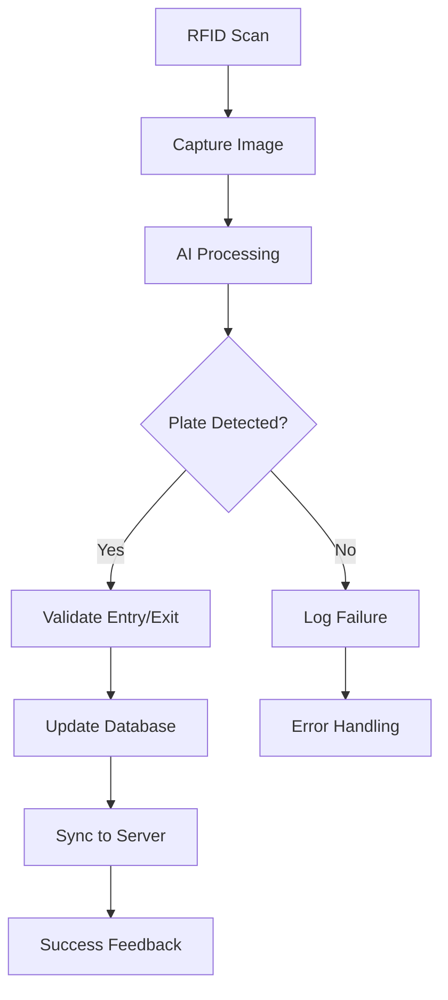

# CE232 - License Plate Recognition & RFID Parking System

[](https://www.python.org/downloads/)
[](LICENSE)
[](https://github.com/psf/black)

## 🚗 Project Overview

This project is an **on-premise, automated parking management system** that uses computer vision and RFID technology to control vehicle access. It is designed for robust, offline-first operation, ensuring continuous functionality even without a stable network connection. The system captures vehicle entries and exits, validates them against a local database, and synchronizes event data with a remote server.

### ✨ Key Highlights

- 🤖 **AI-Powered**: YOLOv5-based license plate recognition
- 🔄 **Offline-First**: Works without internet connectivity
- 🔒 **Secure**: Multi-layer validation and security checks
- 🌐 **Web Interface**: Real-time monitoring dashboard
- 🧹 **Clean Code**: Modular, maintainable architecture

## 🎯 Features

### Core Functionality
- 🔍 **Real-time License Plate Recognition**: YOLOv5-based model for automatic plate detection and OCR
- 📡 **RFID Integration**: MFRC522 reader for fast and reliable vehicle authentication
- 💾 **Offline-First Operation**: Local SQLite database ensures functionality without network connectivity
- 🔄 **Smart Data Synchronization**: Background thread handles server sync with intelligent retry logic
- 🛡️ **Security Validation**: Multi-layer checks prevent unauthorized access and detect anomalies

### Monitoring & Logging
- 📊 **Web Dashboard**: Real-time monitoring interface built with Flask
- 📝 **Comprehensive Logging**: Structured JSONL access logs and detailed error logging
- 📈 **Statistics & Analytics**: Daily, weekly, and monthly usage reports
- 🚗 **Live Vehicle Tracking**: Real-time view of vehicles currently in the parking lot

### Technical Features
- 🎥 **Live Camera Feed**: Real-time video streaming for monitoring
- 🔧 **Modular Architecture**: Clean, maintainable code structure
- 🏷️ **Type Safety**: Comprehensive type hints for better development experience
- ⚙️ **Configuration Management**: Centralized config with environment variables

## 🛠️ Hardware Requirements

### Minimum Requirements
- **Computing Device**: Raspberry Pi 4+ (4GB RAM recommended) or standard PC
- **Camera**: USB Webcam or IP Camera compatible with OpenCV
- **RFID Reader**: MFRC522 module with associated RFID tags
- **LED Indicator**: Green LED for success feedback (GPIO controlled)

### Recommended Setup
- **Raspberry Pi 4 (8GB)** for optimal AI model performance
- **High-resolution camera** (1080p+) for better plate recognition
- **Weatherproof housing** for outdoor installations
- **UPS backup** for continuous operation

## 📦 Software Requirements

### Core Dependencies
```bash
Python 3.8+
PyTorch 2.7.0+
OpenCV 4.11.0+
Flask 3.1.1+
SQLite3 (built-in)
```

### Hardware Interface
```bash
RPi.GPIO          # Raspberry Pi GPIO control
mfrc522           # RFID reader interface
spidev            # SPI communication
```

### AI & Computer Vision
```bash
ultralytics       # YOLOv5 implementation
torch             # PyTorch framework
torchvision       # Computer vision utilities
```

## 🏗️ Architecture

### Project Structure
```
minhtest/
├── 🐍 Core Application
│   ├── LPR.py              # Main application logic
│   ├── app.py              # Flask web interface
│   └── start.sh            # System startup script
├── 🔧 Configuration
│   ├── constants.py        # System constants
│   ├── utils.py            # Utility functions
│   ├── config.py           # Configuration management
│   └── .env               # Environment variables
├── 🤖 AI Modules
│   ├── function/
│   │   ├── helper.py       # License plate OCR
│   │   └── utils_rotate.py # Image preprocessing
│   └── model/             # YOLOv5 model files
├── 🌐 Web Interface
│   └── templates/         # HTML templates
├── 📁 Runtime Data
│   ├── picture/           # Captured images
│   ├── tmp/              # Temporary files
│   └── offline_images/   # Offline storage
└── 📚 Documentation
    ├── README.md
    ├── CODE_CLEANUP.md
    └── GIT_MANAGEMENT.md
```

## 🚀 Quick Start

```bash
# 1. Setup environment
python3 -m venv ai_env
source ai_env/bin/activate
pip install -r requirements.txt

# 2. Configure system
cp .env.example .env
# Edit .env with your settings

# 3. Run system
chmod +x start.sh
./start.sh
```

Access web interface at `http://localhost:5000`

## 📖 How It Works

### System Flow



### Detailed Process

1. **🏁 Initialization**
   - Load configuration from `config.py`
   - Initialize SQLite database
   - Load YOLOv5 models for detection and OCR
   - Setup camera and RFID reader connections
   - Start background sync threads

2. **🔄 Main Loop**
   - Wait for RFID tag scan
   - Capture high-resolution image
   - Process image through AI pipeline
   - Extract and normalize license plate text

3. **🛡️ Validation Logic**
   - **Entry**: Verify plate not already inside
   - **Exit**: Confirm plate matches entry record
   - Apply security checks and business rules
   - Handle edge cases and errors

4. **💾 Data Management**
   - Store all events in local SQLite database
   - Log structured data to JSONL files
   - Background sync to remote server
   - Handle network failures gracefully

## 🌐 Web Interface

Access the monitoring dashboard at `http://localhost:5000`

- 📹 **Live Camera View**: Real-time video feed
- 📝 **Access History**: Event logs with search and pagination
- 🚗 **Vehicles in Lot**: Current occupancy management
- 📈 **Analytics**: Usage statistics and reports

## � Documentation

- 📖 **[Installation Guide](INSTALLATION.md)** - Detailed setup instructions
- 🔧 **[User Manual](USER_MANUAL.md)** - Complete usage guide
- 🏗️ **[Code Architecture](CODE_CLEANUP.md)** - Technical documentation
- 🔧 **[Git Management](GIT_MANAGEMENT.md)** - Repository guidelines

## 📄 License

This project is licensed under the MIT License - see the [LICENSE](LICENSE) file for details.

---

Made with ❤️ for CE232 - Intelligent Parking Management
